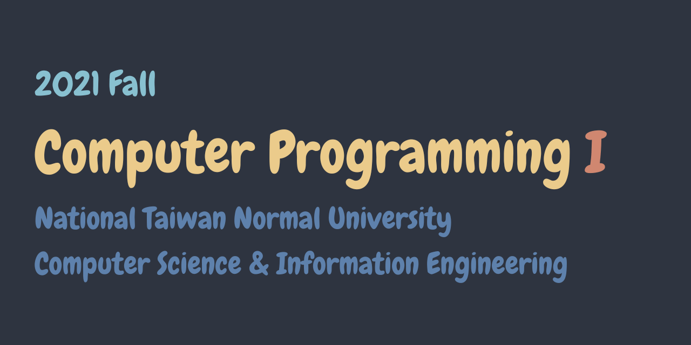

# 師大資工 程式設計一 2021

My homework solutions, not perfect but work (mostly).

[![Open in Gitpod][gitpod-svg]][gitpod-link]

## Homeworks

- [Homework 1](./hw1/) | [Problems][problems-hw1]
- [Homework 2](./hw2/) | [Problems][problems-hw2]
- [Homework 3](./hw3/) | [Problems][problems-hw3]
- [Homework 4](./hw4/) | [Problems][problems-hw4]
- [Homework 5](./hw5/) | [Problems][problems-hw5]
- [Homework 6](./hw6/) | [Problems][problems-hw6]

## Examinations

- [Midterm](./midterm/) | [Problems][problems-mid]
- [Final](./final/) | [Problems][problems-fin]

## Links

- [NTNU CSIE CP1 (2021) Course Website][course-link]
- [Cimple Lib - A delightful library for C learners.][cimple-lib-link]

[gitpod-svg]: https://gitpod.io/button/open-in-gitpod.svg
[gitpod-link]: https://gitpod.io/#https://github.com/JacobLinCool/NTNU-CSIE-CP1
[problems-hw1]: https://drive.google.com/file/d/1to0mEVqryoMyEUD-XLtGlZIluO0oXpET/view
[problems-hw2]: https://drive.google.com/file/d/1IedJ9_q15wMjaYomyPyfifjLpoUVKMUO/view
[problems-hw3]: https://drive.google.com/file/d/17_41gIFPdgiSi40zNXpUpcYHjyj30kyp/view
[problems-hw4]: https://drive.google.com/file/d/1dUo4CEWTG21fq_375cd46a9yTWS5wdlU/view
[problems-hw5]: https://drive.google.com/file/d/18dA8A20cUvkBPJ3wstL-_DA9MNB6MRXA/view
[problems-hw6]: https://drive.google.com/file/d/1QOvXMuxHlm-bvRRXKpwzoOnRnc6f2_RH/view
[problems-mid]: https://drive.google.com/file/d/1cdRh5Kvv1BSDznaq1PVV-20WKANd2bT-/view
[problems-fin]: https://drive.google.com/file/d/1D6a9eSztjs51D6Fl7gZWMzqIPYdHvox9/view
[course-link]: https://sites.google.com/gapps.ntnu.edu.tw/neokent/teaching/2021fall-computer-programming-i
[cimple-lib-link]: https://github.com/JacobLinCool/Cimple-Lib
