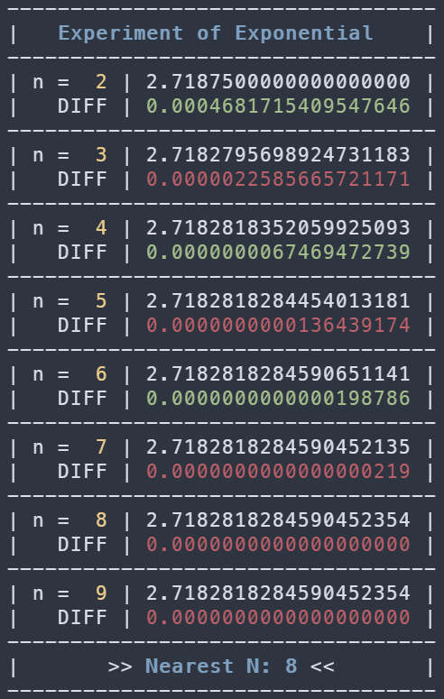

# HW 0304 Experiment of Exponential

In the code `hw0304.c`, we use `calc_e(n)` to calculate the value of $e$ at n "precision".

We can change the code a little bit to make it find a suitable value of n:

```c
long double last = 0;
int64_t nearest = 0;
for (int64_t n = 2; n <= 1e9; n++) {
    long double e = calc_e(n);
    if (e == last) break;
    last = e;
    nearest = n;
}
```

Let's see what the result is:



The green DIFF color means the calculated value is greater than the given truth.

While the red DIFF color means the calculated value is less than the given truth.

After `n = 9`, we get the same result as before (2.7182818284590452354).

But there is still a precision problem when we do the difference between the given truth and the calculated value.

The source code of the experiment is available at `hw0304.1.c`.
