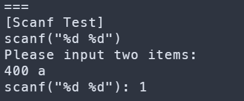
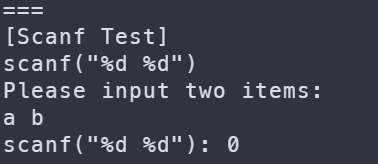

# HW 0405 Bonus: printf and scanf

資工系 114 級 林振可 (41047029S)

## printf

> `man 3 printf`
>
> Upon successful return, these functions return the number of characters printed (excluding the null byte used to end output to strings).
>
> If an output error is encountered, a negative value is returned.

### Success

`printf` will return the number of characters printed.

### Failed

`printf` will return a negative value, maybe -1.

## scanf

> `man 3 scanf`
>
> These functions return the number of input items successfully matched and assigned, which can be fewer than provided for, or even zero in the event of an early matching failure.
>
> The value EOF is returned if the end of input is reached before either the first successful conversion or a matching failure occurs. EOF is also returned if a read error occurs, in which case the error indicator for the stream (see ferror(3)) is set, and errno is set indicate the error.

### Success

`scanf` will return the number of items successfully matched and assigned.

### Failed

`scanf` will return `EOF` if the end of input is reached before the first successful conversion or a failure or error occured.

## Example

There is a simple example to demonstrate the return value of `printf` and `scanf`.

> EOF sometimes be treated as -1

Source code is available in `hw0405.c`.
